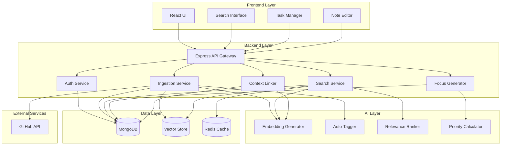

# Design Document: CortexOS

## Overview

CortexOs is a web-based AI productivity platform that unifies notes, code repositories, and tasks into a single searchable knowledge base. The system architecture follows a three-tier design: a React frontend for user interaction, a Node.js/Express backend for business logic and API endpoints, and MongoDB for data persistence. An AI layer provides intelligent features including semantic search, automatic tagging, context linking, and priority generation.

The design emphasizes modularity, with clear separation between data ingestion, storage, search, and AI-powered features. This allows independent scaling and testing of each component while maintaining a cohesive user experience.

## Architecture

### High-Level Architecture



### Component Responsibilities

**Frontend Layer:**
- React UI: Main application shell, routing, state management
- Search Interface: Natural language query input and results display
- Task Manager: Task creation, viewing, and daily focus display
- Note Editor: Rich text editing for notes with markdown support

**Backend Layer:**
- API Gateway: Request routing, authentication middleware, rate limiting
- Auth Service: User registration, login, session management
- Ingestion Service: Content import, GitHub sync, tag generation
- Search Service: Query processing, result ranking, explanation generation
- Focus Generator: Daily priority calculation based on multiple factors
- Context Linker: Relationship detection and suggestion between items

**AI Layer:**
- Embedding Generator: Convert text to vector embeddings for semantic search
- Auto-Tagger: Extract topics and generate tags from content
- Relevance Ranker: Score and rank search results by relevance
- Priority Calculator: Compute task priority scores using multiple signals

**Data Layer:**
- MongoDB: Primary data store for users, items, tasks, links
- Vector Store: Embeddings for semantic similarity search
- Redis Cache: Query result caching, session storage

## Components and Interfaces

### Data Models

#### User
```typescript
interface User {
  id: string;
  email: string;
  passwordHash: string;
  createdAt: Date;
  githubToken?: string;
  settings: UserSettings;
}

interface UserSettings {
  timezone: string;
  focusCount: number; // default 3
}
```

#### KnowledgeItem
```typescript
interface KnowledgeItem {
  id: string;
  userId: string;
  type: 'note' | 'code' | 'task' | 'repository';
  title: string;
  content: string;
  tags: Tag[];
  createdAt: Date;
  updatedAt: Date;
  metadata: ItemMetadata;
  embeddingId?: string;
}

interface Tag {
  name: string;
  source: 'auto' | 'manual';
  confidence?: number; // 0-1 for auto tags
}

interface ItemMetadata {
  // For code files
  filePath?: string;
  language?: string;
  repositoryId?: string;
  
  // For tasks
  deadline?: Date;
  priority?: 'low' | 'medium' | 'high';
  status?: 'todo' | 'in_progress' | 'done';
  lastActivityDate?: Date;
  
  // For repositories
  githubUrl?: string;
  lastSyncDate?: Date;
}
```

#### ContextLink
```typescript
interface ContextLink {
  id: string;
  userId: string;
  sourceItemId: string;
  targetItemId: string;
  linkType: 'manual' | 'suggested' | 'accepted';
  confidence: number; // 0-1
  createdAt: Date;
  status: 'active' | 'rejected' | 'broken';
}
```

#### SearchQuery
```typescript
interface SearchQuery {
  userId: string;
  query: string;
  filters?: {
    types?: ('note' | 'code' | 'task')[];
    tags?: string[];
    dateRange?: { start: Date; end: Date };
  };
}

interface SearchResult {
  items: RankedItem[];
  totalCount: number;
  queryTime: number; // milliseconds
}

interface RankedItem {
  item: KnowledgeItem;
  score: number;
  explanation: string;
  highlights: string[];
}
```

### API Endpoints

#### Authentication
```
POST /api/auth/register
  Body: { email, password }
  Response: { userId, token }

POST /api/auth/login
  Body: { email, password }
  Response: { userId, token }

POST /api/auth/logout
  Headers: { Authorization: Bearer <token> }
  Response: { success: true }
```

#### Knowledge Items
```
POST /api/items
  Headers: { Authorization: Bearer <token> }
  Body: { type, title, content, tags?, metadata? }
  Response: { item: KnowledgeItem }

GET /api/items/:id
  Headers: { Authorization: Bearer <token> }
  Response: { item: KnowledgeItem }

PUT /api/items/:id
  Headers: { Authorization: Bearer <token> }
  Body: { title?, content?, tags?, metadata? }
  Response: { item: KnowledgeItem }

DELETE /api/items/:id
  Headers: { Authorization: Bearer <token> }
  Response: { success: true }

GET /api/items
  Headers: { Authorization: Bearer <token> }
  Query: { type?, tags?, limit?, offset? }
  Response: { items: KnowledgeItem[], total: number }
```

#### Search
```
POST /api/search
  Headers: { Authorization: Bearer <token> }
  Body: { query: string, filters? }
  Response: SearchResult
```

#### Focus Generation
```
GET /api/focus/daily
  Headers: { Authorization: Bearer <token> }
  Response: { priorities: RankedItem[], generatedAt: Date }
```

#### Context Linking
```
POST /api/links
  Headers: { Authorization: Bearer <token> }
  Body: { sourceItemId, targetItemId }
  Response: { link: ContextLink }

GET /api/links/suggestions
  Headers: { Authorization: Bearer <token> }
  Query: { itemId }
  Response: { suggestions: ContextLink[] }

PUT /api/links/:id/accept
  Headers: { Authorization: Bearer <token> }
  Response: { link: ContextLink }

PUT /api/links/:id/reject
  Headers: { Authorization: Bearer <token> }
  Response: { success: true }
```

#### GitHub Integration
```
POST /api/github/connect
  Headers: { Authorization: Bearer <token> }
  Body: { code: string } // OAuth code
  Response: { success: true }

POST /api/github/sync/:repositoryId
  Headers: { Authorization: Bearer <token> }
  Response: { syncedFiles: number, syncTime: number }

DELETE /api/github/disconnect/:repositoryId
  Headers: { Authorization: Bearer <token> }
  Response: { success: true }
```

### Core Algorithms

#### Embedding Generation
```
function generateEmbedding(text: string): number[] {
  // Use a pre-trained model (e.g., sentence-transformers)
  // to convert text into a 384 or 768-dimensional vector
  
  preprocessed = preprocess(text) // lowercase, remove special chars
  embedding = embeddingModel.encode(preprocessed)
  normalized = normalize(embedding) // L2 normalization
  
  return normalized
}
```

#### Auto-Tagging
```
function generateTags(content: string): Tag[] {
  // Extract key phrases using TF-IDF or keyword extraction
  keywords = extractKeywords(content, maxCount=10)
  
  // Use NER (Named Entity Recognition) for specific entities
  entities = extractEntities(content)
  
  // Combine and score
  tags = []
  for keyword in keywords:
    tags.push({
      name: keyword.text,
      source: 'auto',
      confidence: keyword.score
    })
  
  for entity in entities:
    tags.push({
      name: entity.text,
      source: 'auto',
      confidence: entity.confidence
    })
  
  // Return top 10 by confidence
  return tags.sortBy(confidence).slice(0, 10)
}
```

#### Semantic Search
```
function semanticSearch(query: SearchQuery): SearchResult {
  startTime = now()
  
  // Generate query embedding
  queryEmbedding = generateEmbedding(query.query)
  
  // Check cache
  cacheKey = hash(query)
  cached = cache.get(cacheKey)
  if cached and not expired(cached):
    return cached
  
  // Vector similarity search
  vectorResults = vectorStore.search(
    queryEmbedding,
    userId=query.userId,
    filters=query.filters,
    limit=50
  )
  
  // Fetch full items from database
  itemIds = vectorResults.map(r => r.itemId)
  items = database.getItems(itemIds)
  
  // Rank and explain
  rankedItems = []
  for item in items:
    score = calculateRelevanceScore(item, query, vectorResults)
    explanation = generateExplanation(item, query)
    highlights = extractHighlights(item.content, query.query)
    
    rankedItems.push({
      item: item,
      score: score,
      explanation: explanation,
      highlights: highlights
    })
  
  // Sort by score
  rankedItems.sortBy(score, descending=true)
  
  result = {
    items: rankedItems.slice(0, 20),
    totalCount: rankedItems.length,
    queryTime: now() - startTime
  }
  
  // Cache result
  cache.set(cacheKey, result, ttl=300) // 5 minutes
  
  return result
}
```

#### Priority Calculation
```
function calculateDailyPriorities(userId: string): RankedItem[] {
  // Fetch all incomplete tasks
  tasks = database.getTasks(userId, status=['todo', 'in_progress'])
  
  scoredTasks = []
  for task in tasks:
    score = 0
    
    // Deadline urgency (0-50 points)
    if task.metadata.deadline:
      daysUntil = (task.metadata.deadline - now()).days
      if daysUntil <= 2:
        score += 50
      else if daysUntil <= 7:
        score += 30
      else if daysUntil <= 30:
        score += 10
    
    // User priority (0-30 points)
    if task.metadata.priority == 'high':
      score += 30
    else if task.metadata.priority == 'medium':
      score += 15
    
    // Inactivity penalty (0-20 points)
    if task.metadata.lastActivityDate:
      daysSinceActivity = (now() - task.metadata.lastActivityDate).days
      score += min(daysSinceActivity * 2, 20)
    
    scoredTasks.push({
      item: task,
      score: score,
      explanation: generatePriorityExplanation(task, score)
    })
  
  // Sort and return top 3
  scoredTasks.sortBy(score, descending=true)
  return scoredTasks.slice(0, 3)
}
```

#### Context Link Detection
```
function detectContextLinks(newItem: KnowledgeItem): ContextLink[] {
  // Generate embedding for new item
  newEmbedding = generateEmbedding(newItem.content)
  
  // Find similar items using vector search
  similarItems = vectorStore.search(
    newEmbedding,
    userId=newItem.userId,
    limit=20,
    threshold=0.7 // cosine similarity threshold
  )
  
  suggestions = []
  for similar in similarItems:
    // Skip if already linked
    if linkExists(newItem.id, similar.itemId):
      continue
    
    // Calculate confidence based on multiple signals
    confidence = 0
    
    // Vector similarity (0-0.4)
    confidence += similar.score * 0.4
    
    // Tag overlap (0-0.3)
    sharedTags = intersection(newItem.tags, similar.item.tags)
    confidence += (sharedTags.length / max(newItem.tags.length, similar.item.tags.length)) * 0.3
    
    // Temporal proximity (0-0.3)
    daysDiff = abs((newItem.createdAt - similar.item.createdAt).days)
    temporalScore = max(0, 1 - daysDiff / 30) // decay over 30 days
    confidence += temporalScore * 0.3
    
    if confidence >= 0.6: // minimum threshold
      suggestions.push({
        sourceItemId: newItem.id,
        targetItemId: similar.itemId,
        linkType: 'suggested',
        confidence: confidence,
        status: 'active'
      })
  
  return suggestions.sortBy(confidence, descending=true).slice(0, 5)
}
```

### GitHub Integration Flow

```
1. User initiates GitHub connection
   - Frontend redirects to GitHub OAuth
   - User authorizes CortexOs

2. OAuth callback received
   - Exchange code for access token
   - Store encrypted token in user record

3. Repository import
   - Fetch repository list from GitHub API
   - User selects repositories to import
   - For each repository:
     a. Clone repository metadata
     b. Fetch file tree
     c. For each file:
        - Create KnowledgeItem (type='code')
        - Generate embedding
        - Auto-generate tags
        - Store in database and vector store

4. Periodic synchronization (every 5 minutes)
   - Check for repository updates via GitHub webhooks or polling
   - Fetch changed files
   - Update corresponding KnowledgeItems
   - Regenerate embeddings if content changed
```


## Correctness Properties

A property is a characteristic or behavior that should hold true across all valid executions of a system—essentially, a formal statement about what the system should do. Properties serve as the bridge between human-readable specifications and machine-verifiable correctness guarantees.

### Property 1: Note Creation Completeness
*For any* note content, when a user creates a note, the stored note should have a non-null timestamp and at least one auto-generated tag.
**Validates: Requirements 1.1**

### Property 2: Repository Import Completeness
*For any* GitHub repository, when a user connects it, all files in the repository should be imported as KnowledgeItems with type='code'.
**Validates: Requirements 1.2, 7.2**

### Property 3: Task Creation Flexibility
*For any* combination of optional task fields (deadline, priority, description), when a user creates a task, the system should store it successfully with the provided fields.
**Validates: Requirements 1.3**

### Property 4: Content Tagging Invariant
*For any* ingested content (note, code, or task), the resulting KnowledgeItem should have at least one tag assigned.
**Validates: Requirements 1.4**

### Property 5: Search Result Explanation Completeness
*For any* search query that returns results, each result should include a non-empty explanation field.
**Validates: Requirements 2.2**

### Property 6: Search Type Inclusivity
*For any* search query without type filters, when items of multiple types exist that match the query, the results should include items of all types (notes, code, tasks).
**Validates: Requirements 2.3**

### Property 7: Search Result Ordering
*For any* search results, the items should be ordered in descending order by relevance score.
**Validates: Requirements 2.4**

### Property 8: Focus Generator Count Constraint
*For any* user with N incomplete tasks, when requesting daily priorities, the system should return min(N, 3) tasks.
**Validates: Requirements 3.1**

### Property 9: Priority Scoring Monotonicity
*For any* two tasks where task A has a closer deadline than task B (and all other factors equal), task A should have a higher or equal priority score than task B.
**Validates: Requirements 3.2**

### Property 10: Urgent Task Prioritization
*For any* task with a deadline within 48 hours and status not 'done', when generating daily priorities, that task should appear in the returned list if at least 3 incomplete tasks exist.
**Validates: Requirements 3.4**

### Property 11: Context Link Creation from Source
*For any* KnowledgeItem (note or code), when a user creates a task from it, a ContextLink should exist with sourceItemId=task.id and targetItemId=source.id.
**Validates: Requirements 4.1, 4.2**

### Property 12: Context-Based Tag Inheritance
*For any* task created from a source item with tags, the task should receive at least one tag that is semantically related to the source tags.
**Validates: Requirements 4.3**


## Error Handling

### Authentication Errors
- Invalid credentials: Return 401 with message "Invalid email or password"
- Expired token: Return 401 with message "Session expired, please login again"
- Missing token: Return 401 with message "Authentication required"
- Insufficient permissions: Return 403 with message "Access denied"

### Validation Errors
- Missing required fields: Return 400 with message listing missing fields
- Invalid field types: Return 400 with message specifying expected type
- Invalid email format: Return 400 with message "Invalid email address format"
- Weak password: Return 400 with message "Password must be at least 8 characters"
- Tag limit exceeded: Return 400 with message "Maximum 10 tags allowed per item"

### Resource Errors
- Item not found: Return 404 with message "Knowledge item not found"
- User not found: Return 404 with message "User not found"
- Repository not found: Return 404 with message "Repository not found"

### External Service Errors
- GitHub API failure: Return 502 with message "GitHub service temporarily unavailable"
- GitHub OAuth failure: Return 400 with message "GitHub authorization failed"
- Embedding service failure: Log error, return 500 with message "Search service temporarily unavailable"

### Rate Limiting
- Rate limit exceeded: Return 429 with header "Retry-After: 60" and message "Rate limit exceeded, try again in 60 seconds"
- Rate limits: 100 requests per minute per user for search, 1000 requests per minute for other endpoints

### Database Errors
- Connection failure: Return 503 with message "Service temporarily unavailable"
- Transaction failure: Rollback changes, return 500 with message "Operation failed, please try again"
- Duplicate key: Return 409 with message "Resource already exists"

### Error Logging
All errors should be logged with:
- Timestamp
- User ID (if authenticated)
- Request path and method
- Error type and message
- Stack trace (for 5xx errors)


## Testing Strategy Overview

- Unit testing for services and APIs
- Property-based testing for priority scoring and link detection
- Integration testing for GitHub sync
- End-to-end testing for core user flows


### Dual Testing Approach

CortexOs will employ both unit testing and property-based testing to ensure comprehensive correctness validation:

**Unit Tests** focus on:
- Specific examples demonstrating correct behavior
- Edge cases (empty inputs, boundary values, null handling)
- Error conditions and exception handling
- Integration points between components
- Mock external services (GitHub API, embedding models)

**Property-Based Tests** focus on:
- Universal properties that hold for all inputs
- Comprehensive input coverage through randomization
- Invariants that must be maintained across operations
- Round-trip properties (e.g., serialize/deserialize)

Both approaches are complementary and necessary. Unit tests catch concrete bugs and validate specific scenarios, while property tests verify general correctness across a wide input space.

### Property-Based Testing Configuration

**Library Selection:**
- Use `fast-check` for JavaScript/TypeScript property-based testing
- Integrates well with Jest or Mocha test frameworks

**Test Configuration:**
- Each property test must run minimum 100 iterations
- Use deterministic random seed for reproducibility
- Tag each test with a comment referencing the design property

**Tag Format:**
```typescript
// Feature: cortex-os, Property 1: Note Creation Completeness
test('note creation includes timestamp and tags', () => {
  fc.assert(
    fc.property(fc.string(), (content) => {
      const note = createNote(userId, content);
      expect(note.createdAt).toBeDefined();
      expect(note.tags.length).toBeGreaterThan(0);
    }),
    { numRuns: 100 }
  );
});
```

### Test Coverage Requirements

**Backend API Tests:**
- Unit tests for each endpoint (success and error cases)
- Property tests for data validation and business logic
- Integration tests for database operations
- Mock tests for external services (GitHub, AI models)

**Frontend Component Tests:**
- Unit tests for React components using React Testing Library
- Property tests for state management logic
- Integration tests for API communication
- E2E tests for critical user flows (search, task creation)

**AI Component Tests:**
- Unit tests for embedding generation with fixed inputs
- Property tests for tag generation (verify format and count)
- Property tests for priority calculation (verify scoring rules)
- Property tests for link detection (verify confidence bounds)

**Database Tests:**
- Unit tests for query correctness
- Property tests for data integrity constraints
- Integration tests for transaction handling


### Continuous Integration

- Automated test execution on every commit
- Minimum 80% code coverage target
- Basic performance monitoring for search latency
- Dependency vulnerability scanning

